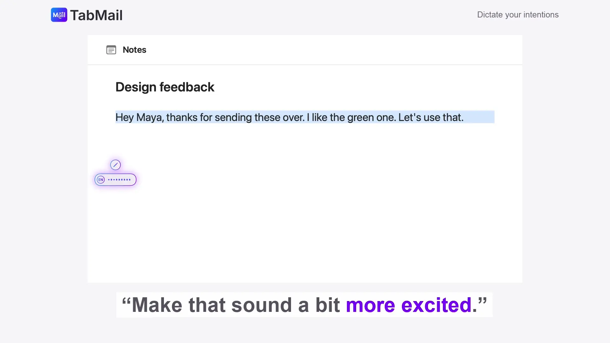
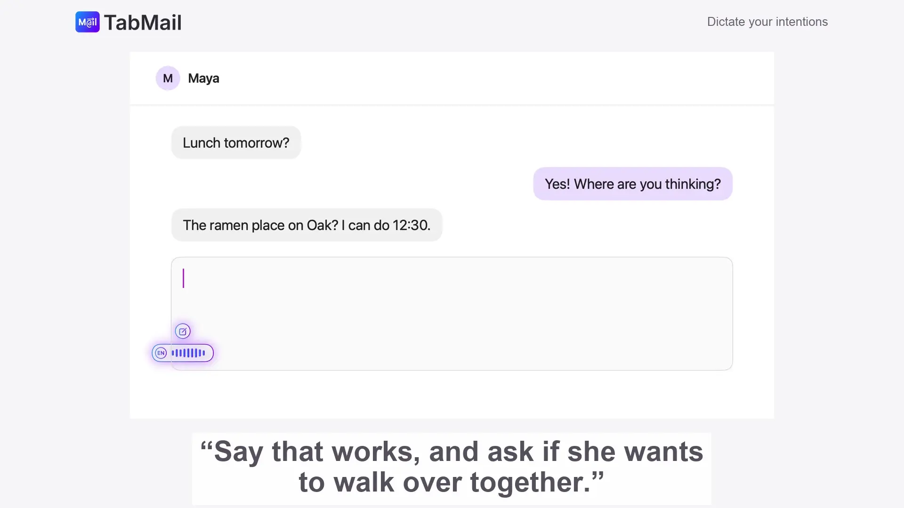

# TabMail Voice

Dictation anywhere on your Mac. Hold **Right Option (⌥)**, speak, and let go: the text is typed
into whatever you're writing in. Speech is transcribed by TabMail's servers and isn't stored.

Requires macOS 15 or later, a TabMail account and an active subscription.
Supports Apple Silicon and Intel Macs.

## Download

Download the signed, notarized macOS installer from [TabMail downloads](https://tabmail.ai/download#voice-install).
Install **TabMail Voice.app** in Applications. It is separate from the TabMail Thunderbird launcher.





[Watch the silent demonstration](https://tabmail.ai/demos/tabmail-promo-voice.mp4).

## Build

1. Create your secrets file from the template and set your Apple Developer Team ID:
   ```sh
   cp Secrets.xcconfig.example Secrets.xcconfig
   ```
   `Secrets.xcconfig` is gitignored. The comments in the template explain each value.
2. Generate the Xcode project (requires [XcodeGen](https://github.com/yonaskolb/XcodeGen)):
   ```sh
   ./apps/macos/Scripts/xcodegen.sh
   ```
   Always use this script rather than a bare `xcodegen generate`: it reads your
   `DEVELOPMENT_TEAM` from `Secrets.xcconfig` and passes it to XcodeGen.
3. Open `apps/macos/TabMailVoice.xcodeproj` and run the `TabMailVoice` scheme, or run the tests:
   ```sh
   xcodebuild -project apps/macos/TabMailVoice.xcodeproj -scheme TabMailVoice -derivedDataPath apps/macos/DerivedData test
   ```

A debug build (what the scheme runs) keeps a detailed log at
`~/Library/Logs/TabMail Voice/TabMail Voice.log`: what you dictated, the text read from your screen,
every request to the TabMail backend and its reply, and what was pasted. The access token and the
audio are never in it. Release builds keep no log file.

Sign with a real team. macOS ties the Microphone and Accessibility permissions to the app's
signature, so an ad-hoc signed build loses them on every rebuild.

## First run

TabMail lives in the menu bar. It asks for:

- **Microphone**: to hear you while you hold the key.
- **Accessibility**: to notice the key from any app and to paste the text for you.

Then sign in with your TabMail email in Settings (we email you a one-time code).

## Using it

- **Hold** the dictation key, speak, **release**. A swirl gathers at your text cursor and turns
  into a pill whose waveform follows your voice once the microphone is listening. When you let
  go, the pill shrinks to a spinning circle while your words are transcribed, then the text is
  typed in.
  The language badge follows the keyboard language selected when you start speaking.
  A quick tap does nothing.
- Press **Space** while holding to toggle agent mode. With text selected, ask Voice to edit it; otherwise, ask it to compose.
- Pressing another key while holding cancels (so ⌥-shortcuts keep working).
- Choose Fn/Globe instead of Right Option in Settings. If you do, set System Settings › Keyboard ›
  "Press 🌐 key to" to "Do Nothing".

## Comparing speech-to-text models

`Scripts/stt-compare/` records you reading `passages.txt` (`record.py`, needs ffmpeg) and runs
every recording through several OpenRouter models (`compare.py`, needs `OPENROUTER_API_KEY`),
scoring word error rate, latency and cost. The default models are the ones whose every
OpenRouter endpoint is Zero Data Retention; the report checks that live and flags any model you
add with `--models` that isn't. Recordings and results stay local (gitignored).

`compare.py` reads `OPENROUTER_API_KEY` from the environment or from a `KEY=value` line in
`Scripts/stt-compare/.env` (gitignored; point elsewhere with `--env-file`). If your key lives in a
root-owned secrets file, leave it there and add `--sudo`: the script asks for your password, has
sudo extract only the key line, and keeps the key in memory without writing it anywhere:
```sh
python3 Scripts/stt-compare/compare.py --sudo --env-file /path/to/secrets.env
```

## Privacy

Audio is sent to the TabMail service for transcription. Optional screen reading sends context
from the front window to help with writing. Turn screen reading off in Settings if desired.
See the [Privacy Policy](https://tabmail.ai/privacy/).

## Contributing

See [CONTRIBUTING.md](CONTRIBUTING.md) for the DCO and development workflow,
[SECURITY.md](SECURITY.md) for private vulnerability reports, and
[TRADEMARKS.md](TRADEMARKS.md) for name and logo usage.

## License

MPL 2.0. See `LICENSE`.
